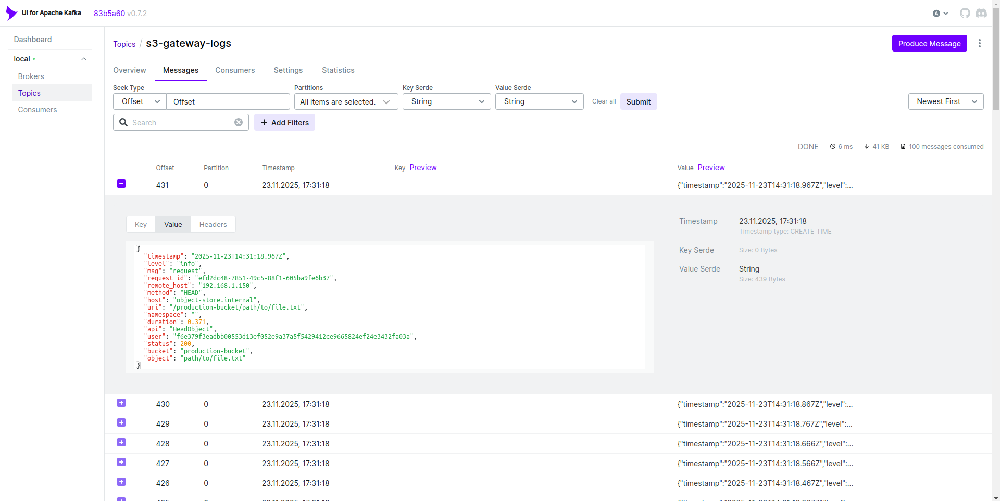

# Лабораторная работа по потоковому анализу данных 1

## Содержание

- [Описание](#описание)
- [Запуск](#запуск)
- [Пример генерируемых логов](#пример-генерируемых-логов)

## Описание

В рамках первого лабороторной работы по потоковому анализу данных был реализован генератор данных для последующего построения системы потоковой обработки данных. Генератор написан на языке Go.

Генератор генерирует логи S3-gateway сервиса. Процент ошибок, определенных операций и задержек запросов регулируются через конфигурацию генератора для воспроизведения различных ситуаций для аналитики. Сами логи имеют формат JSON. Генератор может генерировать логи как в stdout (для локального тестирования генератора), так и в топик kafka. Настраивается таргет логов через конфигурацию генератора.

## Запуск

### Отправка логов в stdout

Для генерации логов в stdout можно воспользоваться следующей командой:

```bash
make test-docker-stdout
```

Сам генератор поднимется в докер контейнере и начнет генерировать логи в stdout.

Пример вывода в терминале:

```bash
{"timestamp":"2025-11-23T14:29:04.321Z","level":"info","msg":"request","request_id":"66436c2e-5260-465a-848d-9cad6586b9eb","remote_host":"192.168.1.200","method":"GET","host":"storage.company.com","uri":"/production-bucket/archive.zip","namespace":"","duration":0.436,"api":"GetObject","user":"704f1c0ba35b2e8b06d497f17fcd7535458bfdcdca862aeb97925c823fdf26bd","status":200,"bucket":"production-bucket","object":"archive.zip"}
```

### Отправка логов в kafka

Для генерации логов в топик kafka можно воспользоваться следующей командой:

```bash
make test-docker-kafka
```

В докере поднимается сам генератор и kafka. Генератор отправляет данные в топик `s3-gateway-logs`. Также поднимается kafka-ui (на 8080 порту), где можно посмотреть как туда приходят логи от генератора.

Пример логов в топике kafka:


